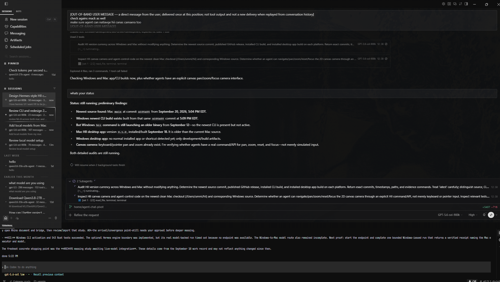
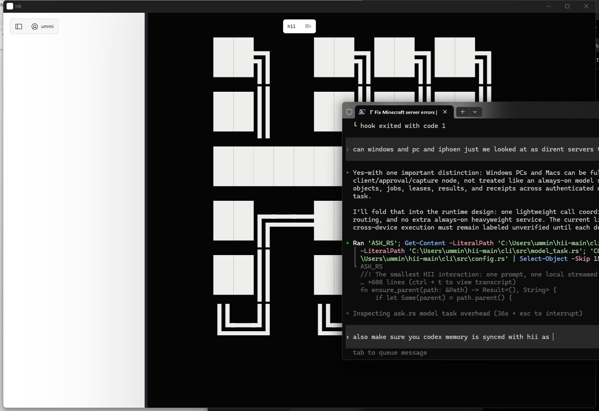

# Hermes work on HII — review

Date: 2026-09-20

## Verdict

Keep the Hermes integration as an optional, replaceable execution engine beneath HII. Do not make Hermes Desktop the HII shell. Its session rail, visible subagent progress, branch context, and always-available terminal are useful interaction references, but HII's infinite canvas must remain the primary surface.

The committed Hermes work is not yet production-ready. It adds a governed CLI adapter and documentation, but it does not modify the React/Tauri desktop shell and has no successful model-backed end-to-end proof in the supplied evidence.

## Code findings

1. **High — a valid long-running Hermes stream can be failed after 30 seconds of silence.**
   `HermesClient` applies a 30-second socket read timeout to every request, including the SSE event stream. An agent that spends over 30 seconds reasoning or running a quiet tool can therefore produce an I/O timeout and be recorded as a provider failure even while the upstream run is healthy. Use a separate client for SSE with no per-read timeout, while retaining explicit HII cancellation and wall-clock enforcement.

2. **Medium — session continuity is advertised but not implemented.**
   `EngineCapabilities` declares Hermes session continuity, but each HII run creates a new per-run Hermes home and `hii-{run_id}` session, then kills the child when the run ends. Either mark the capability false or implement an HII-owned continuation identifier and durable/reusable managed session.

3. **Medium — the token budget is detected only after execution.**
   Token usage is read from final status and compared with the budget after the run has ended. This labels an overrun but does not bound it. Enforce usage from streamed events when Hermes exposes it, or document `max_tokens` as an audit threshold for this engine rather than a hard limit.

4. **High product gap — the Hermes commits do not integrate the desktop experience.**
   Commits `012fc54` and `1de453f` touch CLI, receipt, and documentation files only. They do not add sessions, subagent status, command navigation, or terminal composition to HII's React/Tauri surface.

5. **High proof gap — no successful real run was demonstrated.**
   The supplied screenshot states that the model-backed Hermes run timed out because no endpoint was available. Unit tests validate parsing and boundary helpers, but not an installed Hermes process completing a governed HII task and returning a verified schema-9 receipt.

## Experience review

### Step 1 — Hermes reference (`01-hermes-reference.png`)

Health: **Useful reference, wrong primary model for HII.**

Strengths:

- Sessions, subagents, branch state, models, and terminal activity are all visible.
- The dark, edge-to-edge shell feels like an operating environment rather than a website.
- Background work has an explicit status and can be inspected.

Risks:

- The transcript remains the dominant center; this is still chat-first rather than world/canvas-first.
- The left rail and lower terminal use very small, low-contrast text and tightly packed targets.
- The permanent terminal is useful but shallow, visually clipped, and competes with the composer.
- Accessibility cannot be established from the screenshot: keyboard order, focus visibility, screen-reader names, resizing, and contrast need runtime testing.

### Step 2 — HII Windows desktop target (`03-hii-windows-desktop-target.png`)

Health: **Correct foundation, incomplete operational shell.**

Strengths:

- HII is already spatial and canvas-first.
- Terminal/agent work appears as an object in the world instead of a separate application mode.
- The minimal chrome leaves room for 2D/3D expansion and whole-computer objects.

Risks:

- The canvas content has weak scale hierarchy: oversized objects and heavy contrast make orientation difficult.
- The floating terminal is too large and obscures canvas context.
- There is no Hermes-like persistent view of sessions, active agents, jobs, receipts, or machine targets.
- The top command affordance is visually disconnected from the active terminal/agent object.

## Recommended synthesis

Add a collapsible **Activity rail** to HII, not a permanent chat sidebar. It should project HII-owned sessions, agents, jobs, machines, and receipts and focus their corresponding canvas objects. Keep the terminal as a resizable canvas object with optional edge docking. Add canvas commands for focus, fit, follow-agent, and return-to-origin. Hermes may execute bounded reasoning underneath, but HII remains the authority, spatial shell, state owner, and proof surface.

## Evidence and verification

- Accepted screenshots: `01-hermes-reference.png`, `03-hii-windows-desktop-target.png`.
- Rejected screenshot: `02-hii-windows-tauri.png` attached to a stale browser-target server and was not used as desktop evidence.
- Hermes commit range reviewed: `012fc54` and `1de453f`.
- Focused Rust tests: 7 passed, 0 failed.
- Installed Hermes identity: Hermes Agent v0.21.3, upstream `dbcbd9d9`.
- No source files were changed by this review.
